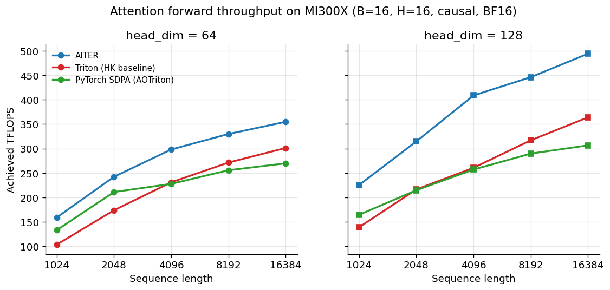

# attn-dsl-bench

A research benchmark comparing FlashAttention forward-kernel implementations on a single AMD Instinct MI300X. Measures three production-grade implementations (AITER, Triton-via-HipKittens, PyTorch SDPA) across a sweep of attention shapes, then uses `rocprofv3` hardware counters to explain the throughput ranking mechanistically.

---

## Key findings

From 30 timing measurements (3 implementations × 5 sequence lengths × 2 head dimensions) and 30 matched hardware-counter measurements at B=16, H=16, causal, BF16:

- **AITER leads at every shape**, by 18–62% over the Triton-on-AMD baseline. The lead is largest at small N and at `head_dim=128`.
- **PyTorch SDPA dispatches to AOTriton** on ROCm — confirmed via the dispatched kernel name (`attn_fwd`). SDPA tracks the Triton baseline closely because both are Triton-lineage kernels.
- **The throughput gap is a matrix-core utilization gap.** At `head_dim=128, N=16384`, AITER reaches 72% MFMA utilization while the Triton-lineage kernels plateau at 33–34%. The full throughput-vs-utilization scatter shows the relationship holds across all 30 cells.
- **Occupancy doesn't explain the ranking.** All three kernels run well below occupancy saturation; the fastest kernel runs at low-to-mid occupancy. The kernels are compute-bound, not latency-bound.
- **Hardware counters cross-check the FLOP accounting** to within 3% (theoretical 5.50×10¹¹ vs measured 5.67×10¹¹ at N=4096, d=64), independently validating the throughput numbers.

→ **Read the writeup:** [Blog post — forthcoming]

---

## Shape grid

All measurements: B=16, H=16, H_KV=16 (no GQA), causal masking, BF16 (FP16 for the TileLang scope-limit run).

| Axis | Values |
|---|---|
| Sequence length (N) | 1024, 2048, 4096, 8192, 16384 |
| Head dimension (D) | 64, 128 |
| Implementations | AITER, Triton (HipKittens baseline), PyTorch SDPA, TileLang (scope-limited) |

---

## Repository structure

    bench/              Timing harness (runner.py) + rocprofv3 profiling runner (profile_runner.py)
    kernels/            Per-implementation wrappers behind a common interface
    configs/            YAML configs — one per (implementation, sweep) combination
    results/raw/        CSV outputs: sweep_v1.csv (timing), counters_v1.csv (hardware counters)
    results/figures/    Three figures: throughput, utilization, throughput-vs-utilization scatter
    analysis/           plot_sweep.py — regenerates the figures from the CSVs
    notes/              Feasibility report, first-run notes, rocprofv3 counter reference

---

## Reproduction

Requires ROCm ≥ 7.2 and a CDNA3 GPU (MI300X / gfx942). Tested on ROCm 7.2.2 with PyTorch 2.10.0 (HIP build).

    pip install -r requirements.txt

    # Timing sweep, one implementation at a time
    python3 -m bench.runner --config configs/sweep_v1_aiter.yaml  --output results/raw/sweep_v1.csv
    python3 -m bench.runner --config configs/sweep_v1_triton.yaml --output results/raw/sweep_v1.csv
    python3 -m bench.runner --config configs/sweep_v1_sdpa.yaml   --output results/raw/sweep_v1.csv

    # Hardware-counter sweep
    python3 -m bench.profile_runner --config configs/sweep_v1_aiter.yaml  --output results/raw/counters_v1.csv
    python3 -m bench.profile_runner --config configs/sweep_v1_triton.yaml --output results/raw/counters_v1.csv
    python3 -m bench.profile_runner --config configs/sweep_v1_sdpa.yaml   --output results/raw/counters_v1.csv

    # Regenerate figures
    python3 analysis/plot_sweep.py

---

## Calibration

The harness was calibrated against [HipKittens](https://github.com/HazyResearch/HipKittens)' published AITER baseline at the reference shape (B=16, H=16, N=16384, D=64, causal, BF16). HipKittens reports 355.0 TFLOPS; this harness measures 352.5. Within 0.7%.

---

## Scope and limitations

- **Forward pass only.** The backward kernel is a different implementation with different performance characteristics; nothing here generalizes to training.
- **No GQA, no decode regime.** B=16, H=H_KV=16. Production LLM inference often uses grouped-query attention and the B=1 decode regime; neither is covered here.
- **TileLang as scope limit.** The TileLang result is a single calibration data point from a generic FlashAttention example (`example_mha_fwd_bhsd.py`, FP16). It is not treated as a peer-comparable measurement of TileLang on MI300X.
- **Counter dispatch-noise at small N for Triton.** Triton's autotuner produces hundreds of small dispatches per profile cell at small N; `MfmaUtil` is a cycle ratio and trends cleanly, but the raw dispatch count differs from AITER's flat 8.

See the blog post (link above) for the full discussion, including the iteration record and TileLang scope-limit reasoning.

---

## License

MIT.
